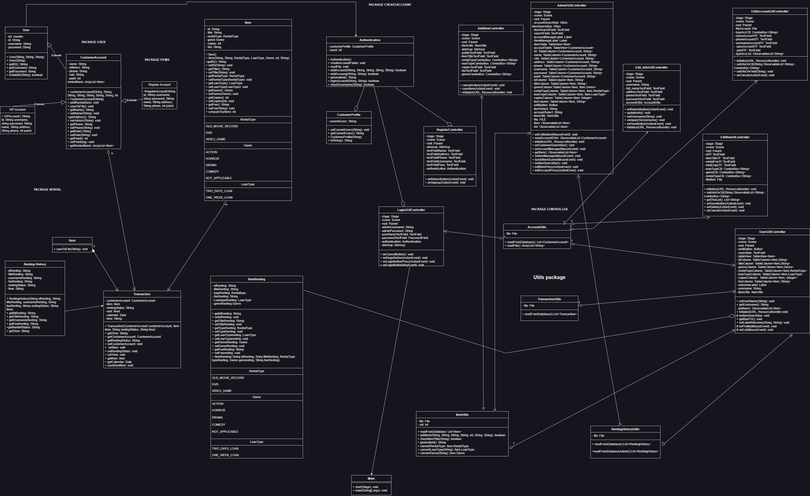

<h1 align="center">FINAL PROJECT - GINIE'S VIDEO STORE MANAGER</h1>

<h2>POWERED BY: CHIHUAHUA TEAM </h2>

## TABLE OF CONTENT

**I. [CONTRIBUTION INFORMATION](#i-contribution-information)**\
**II. [FORMAT DEFINITION](#!-contribution-information)**\
**III. [PROJECT LINKS](#ii-project-links)**\
**IV. [REFERENCES](#iii-references)**

___

### I. CONTRIBUTION INFORMATION

_While each member participates in all project's stages, this section highlights his/her major contributions. In general, each member shares an equal 20% of total project contributions._

#### CONTRIBUTOR 1: [MAI DANG KHOA](https://github.com/vhpx) (ID: S3974876)
>As a coding artist, Khoa was primarily responsible for developing and working with the FXML file, which includes SceneBuilder and every CSS Stylesheet which are the front-end part. He additionally generated the welcome label, show rental, modify account functions, renting and return function of the project. He is also in charge of organizing and planning the team's API process.

#### CONTRIBUTOR 2: [NGO VAN TAI](https://github.com/VanTaizz) (ID: S3974892)
>Tai was in charge of writing code related to items. All the tables related to items were responsible for Tai including adding items or removing items. Most precious function that has been done by Tai was sorting items, and sorting account system. Additionally, another mission of Tai was checking the app and fixing minor bugs to ensure that the app was doing well without errors. Tai was also a mentor for Khoa in designing the application GUI.

#### CONTRIBUTOR 3: [DUONG MINH TRI](https://github.com/TriDuong070803) (ID: S3924472)
>Tri was the best navigator for the customer, all the button and path were under his hand. Event action, Mouse Action, KeyEvent were constructed and arranged by himself. Generally, Tri was in charged in making all the controller for customer to interface with the GUI. Tri also cooperate with Khoa to planning where the buttons should locate on the interface. Every mouse clicks has to pass through his work.

#### CONTRIBUTOR 4: [HUYNH TAN PHAT](https://github.com/phatgg221) (ID: S3929218)
>Together with Tai and Khoa, as the person who has the best skills in development Phat were chosen to taking the tough function in the project. Renting process, calculating the point and up-level the customer were all made by Phat. Phat also working mostly with the admin API. Moreover, Phat was taking part in the renting and return function with Khoa.
___

### II. FORMAT DEFINITION
#### ACCOUNT'S FORMAT
> For the account format we will separate each data using comma ",". However, we decide to make some changes, so the final format will be: [ID, Username, Password, Name, Address, Phone number, Account-level, Point].     
> 
> The customers are forced to input username and password when they regis, but other information are optional. So if user want to not input any info beside username and password, it will save "null" into the text file.
---
- [**ACCOUNT TEXT FILE LINK**](src/main/java/com/example/finalproject_oop_2023/SavingText/Account.txt)
---

#### ITEM'S FORMAT
> For the item format we will separate each data using comma ",". So the item file will have form of: [ID, Title ,Rental type, Loan type, Copy, Price, Genre].    
>    
> Since an item which has the rental type is "VIDEO_GAME" will not have its genre. For the convenience, whenever  an item is "VIDEO_GAME", its genre will be saved as "NOT_APPLICABLE".
--- 
- [**ITEM TEXT FILE LINK**](src/main/java/com/example/finalproject_oop_2023/SavingText/items.txt)
---
#### RENTING LIST'S FORMAT
> The renting list was created to save any renting information. It is important when admin want to see the productivity and the performance, also which item is rented or returned. And the form is: [Item's ID , Customer's username, The status, Time of that action].   
>    
> So when an item is rented or return, its ID and the customer ID will be saved into the renting list text file, a function to capture the time will appear to record the current time, and then save it into the text file.
---
- [**RENTING LIST TEXT FILE LINK**](src/main/java/com/example/finalproject_oop_2023/SavingText/RentingList.txt)

---
#### TESTING ACCOUNT LIST

*ADMIN ACCOUNT*
>User: admin   
Password: admin

*VIP ACCOUNT*
>User: minhdinh  
> Password: 123456
---
### III. PROJECT LINKS

- [**GITHUB REPOSITORY LINK**](https://github.com/Kyle4Bits/FinalProject_OOP_2023)  

----
- [**UML DIAGRAM LINK**](https://drive.google.com/file/d/14LAIRdu9v7yzG7a0CSV5ZZPWgnjzSMs4/view?usp=sharing)

___

### IV. REFERENCES
**[1]** Vu Thanh Minh. "Assignments – Final Project", Semester 1, 2023. rmit.instructure.com. Accessed on May. 01, 2023.
Available for authorized personnel: https://rmit.instructure.com/courses/118552/assignments/805563
